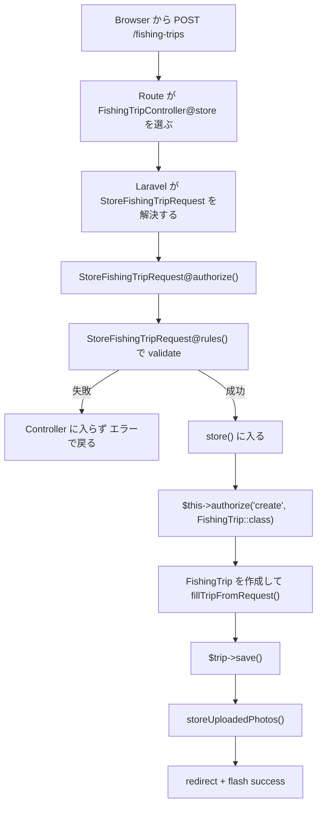

# 第2章：Request と Controller で組む CRUD

この章では、  
**釣行の作成・更新・削除が、`FormRequest` と `Controller` でどう分かれているか**を整理する。

ポイントは次の3つ。

- 入力チェックは `FormRequest` に置く
- 保存処理は `FishingTripController` にまとめる
- 画像の追加・削除も Controller で流れを管理する

---

## 2-1 まず `FormRequest` を見る

### 対象ファイル（Request）

- `anglers/app/Http/Requests/StoreFishingTripRequest.php`
- `anglers/app/Http/Requests/UpdateFishingTripRequest.php`
- `anglers/app/Http/Requests/DestroyFishingTripRequest.php`

### 作成コマンド

```bash
./vendor/bin/sail artisan make:request StoreFishingTripRequest
./vendor/bin/sail artisan make:request UpdateFishingTripRequest
./vendor/bin/sail artisan make:request DestroyFishingTripRequest
```

### Laravel が最初に作る雛形

```php
<?php

namespace App\Http\Requests;

use Illuminate\Foundation\Http\FormRequest;

class StoreFishingTripRequest extends FormRequest
{
    /**
     * Determine if the user is authorized to make this request.
     */
    public function authorize(): bool
    {
        return false;
    }

    /**
     * Get the validation rules that apply to the request.
     *
     * @return array<string, \Illuminate\Contracts\Validation\ValidationRule|array<mixed>|string>
     */
    public function rules(): array
    {
        return [
            //
        ];
    }
}
```

### 雛形の意味

- `authorize()` は最初は `false`
- `rules()` は最初は空
- そのままでは Request は通らない

### 今回の実装で変えていること

- `authorize()` を `true` にする
- `rules()` に入力ルールを書く
- 認可の本体は Controller の `$this->authorize(...)` で見る

### `store` のルール

```php
public function rules(): array
{
    return [
        'trip_date' => ['required', 'date'],
        'start_at' => ['required', 'date'],
        'end_at' => ['required', 'date', 'after:start_at'],
        'river_name' => ['required', 'string', 'max:100'],
        'point_name' => ['required', 'string', 'max:100'],
        'tackle_name' => ['required', 'string', 'max:200'],
        'memo' => ['nullable', 'string', 'max:2000'],
        'photos' => ['nullable', 'array'],
        'photos.*' => ['file', 'mimes:png,jpeg,jpg', 'max:10240'],
    ];
}
```

### `update` のルール

```php
public function rules(): array
{
    return [
        'mod_id' => ['required', 'string'],
        'trip_date' => ['required', 'date'],
        'start_at' => ['required', 'date'],
        'end_at' => ['required', 'date', 'after:start_at'],
        'river_name' => ['required', 'string', 'max:100'],
        'point_name' => ['required', 'string', 'max:100'],
        'tackle_name' => ['required', 'string', 'max:200'],
        'memo' => ['nullable', 'string', 'max:2000'],
        'remove_photo_ids' => ['nullable', 'array'],
        'remove_photo_ids.*' => ['string'],
        'photos' => ['nullable', 'array'],
        'photos.*' => ['file', 'mimes:png,jpeg,jpg', 'max:10240'],
    ];
}
```

### `destroy` のルール

```php
public function rules(): array
{
    return [
        'mod_id' => ['required', 'string'],
    ];
}
```

### この実装で見えること

- 入力の妥当性は `Request` で見る
- 更新と削除は `mod_id` を必須にしている
- 画像追加と画像削除の入力も `update` 側でまとめて受ける

> まず入力を揃えてから Controller に渡す形にしている

---

## 2-2 `authorize()` は Request ではなく Controller 側に寄せている

### 対象コード（Request）

```php
public function authorize(): bool
{
    return true;
}
```

### このコードの意味

- Request 自体では認可判定をしていない
- 入力チェックの置き場として Request を使っている
- 認可は別で見る前提になっている

### この形にする理由

- バリデーションと認可を分けて読める
- 認可ルールは `Policy` と Controller に集約できる
- どこで何を判断するかが見えやすい

---

## 2-3 validate はどこで動くのか

### 対象コード（Controller シグネチャ）

```php
public function store(StoreFishingTripRequest $request): RedirectResponse
```

### 先に結論

- validate は `store()` の中ではなく、その前に動く
- `StoreFishingTripRequest` が解決されるときに `authorize()` と `rules()` が実行される
- 失敗した場合、Controller 本文には入らない

### フロー全体



### このフローで押さえること

- Request の validate が先
- Controller の `$this->authorize()` はその後
- つまり `store()` の中では「入力は通っている」前提で保存処理を書いている

### 今回の実装で実際に起きること

`StoreFishingTripRequest` はこうなっている。

```php
public function authorize(): bool
{
    return true;
}
```

```php
public function rules(): array
{
    return [
        'trip_date' => ['required', 'date'],
        'start_at' => ['required', 'date'],
        'end_at' => ['required', 'date', 'after:start_at'],
        'river_name' => ['required', 'string', 'max:100'],
        'point_name' => ['required', 'string', 'max:100'],
        'tackle_name' => ['required', 'string', 'max:200'],
        'memo' => ['nullable', 'string', 'max:2000'],
        'photos' => ['nullable', 'array'],
        'photos.*' => ['file', 'mimes:png,jpeg,jpg', 'max:10240'],
    ];
}
```

### つまりどう読むか

- Request 側の `authorize()` は常に通す
- Request 側の `rules()` で入力形式を確認する
- そのあとで Controller 側の `authorize('create', ...)` が動く

> このコードでは、  
> `validate` と `認可` を別の場所で順番に見ている

---

## 2-4 `store()` は新規作成の中心

### 対象ファイル（Controller）

- `anglers/app/Http/Controllers/FishingTripController.php`

```php
public function store(StoreFishingTripRequest $request): RedirectResponse
{
    $this->authorize('create', FishingTrip::class);

    $trip = new FishingTrip();
    $trip->id = (string) Str::uuid();
    $trip->user_id = (string) $request->user()->id;

    $this->fillTripFromRequest($trip, $request);

    $trip->save();

    $this->storeUploadedPhotos($trip, $request->file('photos', []));

    return to_route('fishing-trips.edit', $trip->id)
        ->with('success', __('Fishing trip saved.'));
}
```

### このコードの役割（update）

- 認可を通す
- 新しい `FishingTrip` を作る
- 入力値をモデルに入れる
- 本体保存のあとで画像を保存する
- 成功メッセージ付きで編集画面へ戻す

### ここで押さえること

- 釣行本体と画像は一度に全部混ぜて保存していない
- まず親を保存し、そのあとで子画像を追加する
- 成功メッセージは flash として返す

---

## 2-5 `update()` は更新と画像操作をまとめる

### 対象コード（更新）

```php
public function update(UpdateFishingTripRequest $request, string $fishing_trip): RedirectResponse
{
    $trip = $this->findFishingTripOrFail($fishing_trip);

    $this->authorize('update', $trip);

    $this->fillTripFromRequest($trip, $request);

    try {
        $trip->withModId((string) $request->string('mod_id'))->save();
    } catch (FileMakerDataApiException $e) {
        if ((int) $e->getCode() === 306) {
            throw ValidationException::withMessages([
                'mod_id' => __('Another update was saved first. Reload the page and try again.'),
            ]);
        }

        throw $e;
    }

    $this->deleteRemovedPhotos($trip, $request->input('remove_photo_ids', []));
    $this->storeUploadedPhotos($trip, $request->file('photos', []));

    return to_route('fishing-trips.edit', $trip->id)
        ->with('success', __('Fishing trip updated.'));
}
```

### このコードの役割（destroy）

- 更新対象を取り出す
- 認可を通す
- 本体を更新する
- 削除対象画像を消す
- 新しい画像を追加する
- 成功時は同じ編集画面に戻す

### ここで見えること

- 本体更新と画像処理の順番が固定されている
- 更新競合の判定もこの中で扱う
- 更新後に画面をリフレッシュしやすい戻り方になっている

---

## 2-6 `destroy()` は削除前に版を確認する

### 対象コード（削除）

```php
public function destroy(DestroyFishingTripRequest $request, string $fishing_trip): RedirectResponse
{
    $trip = $this->findFishingTripOrFail($fishing_trip);

    $this->authorize('delete', $trip);

    if ((string) $trip->getModId() !== (string) $request->string('mod_id')) {
        throw ValidationException::withMessages([
            'mod_id' => __('Another update was saved first. Reload the page and try again.'),
        ]);
    }

    foreach ($trip->photos()->get() as $photo) {
        $photo->delete();
    }

    $trip->delete();

    return to_route('fishing-trips.index')
        ->with('success', __('Fishing trip deleted.'));
}
```

### このコードの役割（値の詰め替え）

- 削除対象を取る
- 認可を通す
- `mod_id` を確認する
- 子画像を消してから親を消す
- 一覧画面へ戻る

### ポイント

- いきなり `delete()` していない
- 親子の削除順を明示している
- 削除でも `mod_id` を要求している

---

## 2-7 値の詰め替えは専用メソッドに寄せる

### 対象コード（共通化）

```php
private function fillTripFromRequest(FishingTrip $trip, StoreFishingTripRequest|UpdateFishingTripRequest $request): void
{
    $trip->trip_date = $request->date('trip_date');
    $trip->start_at = $request->date('start_at');
    $trip->end_at = $request->date('end_at');
    $trip->river_name = (string) $request->string('river_name');
    $trip->point_name = (string) $request->string('point_name');
    $trip->tackle_name = (string) $request->string('tackle_name');
    $trip->memo = $request->filled('memo') ? (string) $request->string('memo') : null;
}
```

### このコードの役割

- `store` と `update` の共通処理をまとめる
- Request から model への代入場所を一箇所にする
- Controller 本文を読みやすくする

### ここで押さえること（共通化）

- 日付変換を Controller に散らしていない
- 値の入れ方を揃えられる
- 更新項目が増えても変更箇所を追いやすい

---

## 2-8 `firstOrFail()` は何をしているか

### 対象コード（対象取得）

```php
private function findFishingTripOrFail(string $id): FishingTrip
{
    return FishingTrip::where('id', '==', $id)
        ->firstOrFail();
}
```

### `firstOrFail()` の意味

- 条件に合う最初の 1 件を取得する
- 見つからなければ失敗として扱う
- Laravel では通常 404 として止まる

### `first()` との違い

`first()` は、

- 見つかれば 1 件返す
- 見つからなければ `null`

になる。

一方 `firstOrFail()` は、

- 見つかれば 1 件返す
- 見つからなければ例外を投げる

という違いがある。

### 今回の文脈での役割

- 詳細表示の対象を取る
- 編集対象を取る
- 更新対象を取る
- 削除対象を取る

つまり、
**「そのレコードが存在する前提の処理に入る前に、存在確認も兼ねて取得する」**
ための書き方になっている。

### この形にする理由（firstOrFail）

- `null` チェックを毎回手で書かなくてよい
- 対象がないときに早い段階で止められる
- Controller の本文を読みやすくできる

### 書き方について

- `FishingTrip::query()->where(...)` も Laravel 的には正しい
- ただ、資料としては `FishingTrip::where(...)` の方が読みやすい
- この資料では、特に理由がなければ `Model::where(...)` の形で書く

> `firstOrFail()` は、  
> 「見つからなければその時点で止める」という意図を短く書くための形になる

---

## 2-9 Laravel の Collection とは

今回のアプリでは、  
Laravel の **Collection** を使っている。

### Collection とは

- 配列に近いが、Laravel 独自の便利メソッドを持つデータのまとまり
- `map()` `filter()` `first()` `max()` などをつなげて使える
- 複数件データを扱うときに出てくる

### まずは形の違いを単純に見る

```php
$trip
```

- これは `FishingTrip` の **Model 1 件**

```php
$trip->photos()
```

- これは relation
- まだ写真一覧そのものではない
- 「この釣行に紐づく写真を取りに行く準備」という段階

```php
$trip->photos()->get()
```

- ここで **Collection** になる
- 写真が 0 件でも複数件でも入る
- 「写真一覧を取ってきた状態」

```php
$trip->photos()->get()->first()
```

- これは Collection の先頭を 1 件取り出す
- 結果は `FishingTripPhoto` の **Model 1 件** または `null`

```php
$trip->photos()->get()->map(fn ($photo) => [...])
```

- これはまだ **Collection**
- ただし中身は `FishingTripPhoto` のままではなく、画面用に整えた形

```php
$trip->photos()->get()->map(fn ($photo) => [...])->all()
```

- ここで最後に **array**
- 普通の PHP 配列になる

### 一番大事な整理

- `Model` は 1 件
- `Collection` は複数件
- `array` は最後の普通の配列
- `()->get()` すると Collection になることが多い

### このアプリで使っている例

```php
'photos' => $trip->photos()->get()
    ->map(fn (FishingTripPhoto $photo) => [
        'id' => (string) $photo->id,
        'caption' => $photo->caption,
        'sort_order' => $photo->sort_order,
        'image_url' => $photo->image_url,
    ])
    ->values()
    ->all(),
```

### このコードで起きていること

- `$trip->photos()->get()`  
  写真一覧を Collection で取る
- `map(...)`  
  各写真を画面用の形に変える
- `values()`  
  添字を振り直す
- `all()`  
  最後に配列にする

### `map()` は PHP の組み込み関数ではない

ここで使っている `map()` は、
PHP 標準の `array_map()` ではなく、
**Laravel Collection の `map()` メソッド**。

### このアプリで見える Collection の使い方

```php
$trip->photos()->get()->map(...)
```

```php
$trip->photos()->get()->max('sort_order')
```

```php
$trip->photos()->get()->first()
```

### Collection のまま Inertia に渡せるか

渡せる。

Laravel 側では、
Collection のまま Inertia に渡してよい。

ただし Vue に届くときには、
Collection そのものではなく
シリアライズされた配列 / オブジェクトとして受け取る。

### ここで重要なこと

問題なのは、
開発側が自分で次のような流れを作ること。

- `json_encode()` する
- 文字列として渡す
- Vue 側で `JSON.parse()` する

これは Inertia の流れを崩す。

### これは AI が出しがちなズレ

Inertia を正しく理解していない AI は、

- `json_encode()` する
- 文字列として渡す
- Vue 側で `JSON.parse()` する

というコードを出しがち。

これは、
Laravel + API + Vue の感覚をそのまま持ち込んだ形であり、
Inertia の props の流れとは合っていない。

### つまりどうするか

- Collection のまま props に渡すのはよい
- 必要なら `map()` で画面用に整える
- ただし JSON 文字列を手で組み立てて渡さない

> Collection は、  
> 「取ってきた複数件データを、どう整えて使うか」を書きやすくする Laravel の道具になる

---

## 2-10 画像の追加と削除も Controller で流れを管理する

### 対象コード（画像削除）

```php
private function deleteRemovedPhotos(FishingTrip $trip, array $removePhotoIds): void
{
    if ($removePhotoIds === []) {
        return;
    }

    $removePhotoIds = array_map('strval', $removePhotoIds);

    foreach ($trip->photos()->get() as $photo) {
        if (in_array((string) $photo->id, $removePhotoIds, true)) {
            $photo->delete();
        }
    }
}
```

### 対象コード（画像追加）

```php
private function storeUploadedPhotos(FishingTrip $trip, array $uploadedPhotos): void
{
    if ($uploadedPhotos === []) {
        return;
    }

    Storage::makeDirectory('tmp');

    $sortOrder = (int) ($trip->photos()->get()->max('sort_order') ?? 0);

    foreach ($uploadedPhotos as $uploadedPhoto) {
        $path = $uploadedPhoto->store('tmp');
        $fullPath = Storage::path($path);

        try {
            ImageManager::gd()
                ->read($uploadedPhoto)
                ->scaleDown(1600, 1600)
                ->save($fullPath);

            $photo = new FishingTripPhoto();
            $photo->id = (string) Str::uuid();
            $photo->fishing_trip_id = (string) $trip->id;
            $photo->sort_order = ++$sortOrder;
            $photo->caption = null;
            $photo->image = new File($fullPath);
            $photo->save();
        } finally {
            Storage::delete($path);
        }
    }
}
```

### このコードで見えること

- 削除対象は `remove_photo_ids` で受ける
- 追加画像は tmp 保存して加工する
- 画像保存後は tmp を必ず消す
- `sort_order` をここで進める

---

## 第2章のまとめ

> この実装では、  
> **入力は `Request`、保存の流れは `Controller`** に分けている。

- `FormRequest` で入力形式を揃える
- 認可は Request ではなく Controller 側で行う
- `store` `update` `destroy` が CRUD の中心になる
- 画像の追加・削除も Controller で順序立てて扱っている
