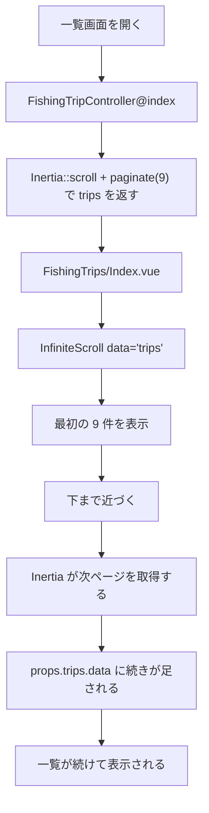

# 第6章：Inertia v2 のスクロール読み込み

この章では、  
**Inertia v2 で実装しやすくなった、スクロールに応じた一覧の追加読み込み** を整理する。

ポイントは次の3つ。

- サーバ側は `Inertia::scroll()` を使う
- Vue 側は `InfiniteScroll` を使う
- `axios` で独自に無限スクロールを組まなくてよい

---

## 6-1 何が楽になったのか

一覧をスクロールしながら追加で読み込む機能は、
以前は自分で組むと次のようなことが必要になりやすかった。

- どの位置までスクロールしたかを監視する
- 次のページ番号を自分で管理する
- 読み込み中かどうかを自分で持つ
- 次ページがあるかどうかを自分で判断する
- 取得した配列を自分で結合する
- `axios` で追加リクエストを投げる

Inertia v2 では、
このあたりを **Laravel + Inertia の流れの中で扱いやすくなった。**

### この教材での方針

- 一覧の追加読み込みは Inertia v2 の仕組みを使う
- `axios` で独自に無限スクロールを組まない
- ページネーションと追加読み込みは Laravel + Inertia に乗せる

> つまり、  
> 「動く無限スクロールを手書きする」のではなく、  
> Inertia の流れに寄せて実装する

---

## 6-2 サーバ側は `Inertia::scroll()`

### 対象ファイル（Controller）

- `anglers/app/Http/Controllers/FishingTripController.php`

```php
public function index(Request $request): Response
{
    $this->authorize('viewAny', FishingTrip::class);

    return inertia('FishingTrips/Index', [
        'trips' => Inertia::scroll(fn () => FishingTrip::query()
            ->orderBy('trip_date', 'desc')
            ->orderBy('start_at', 'desc')
            ->paginate(9)
            ->through(fn (FishingTrip $trip) => $this->tripCardData($trip, (string) $request->user()->id))),
    ]);
}
```

### このコードの役割（InfiniteScroll）

- 一覧データ `trips` を Inertia のスクロール読み込み用として返す
- 1 回に 9 件ずつ返す
- 各レコードをカード表示用の形に整える

### このコードで見えていること

- `paginate(9)`  
  9 件ずつ返す
- `through(...)`  
  各釣行を画面用の配列に整える
- `Inertia::scroll(...)`  
  この props は追加読み込み前提だと Inertia に伝える

### ここで押さえること

- 普通の一覧ではなく「追加読み込みする一覧」として返している
- Controller 側でスクロール用データの入口を作っている
- `trips` は最初から全部返していない

---

## 6-3 Vue 側は `InfiniteScroll` を使う

### 対象ファイル（一覧画面）

- `anglers/resources/js/Pages/FishingTrips/Index.vue`

```vue
<InfiniteScroll data="trips" :buffer="320" as="section">
  <template #default="{ loadingNext, hasNext }">
    <div v-if="props.trips.data.length" class="grid gap-6 md:grid-cols-2 xl:grid-cols-3">
      <article
        v-for="trip in props.trips.data"
        :key="trip.id"
        class="overflow-hidden rounded-2xl border border-slate-200 bg-white shadow-sm"
      >
        ...
      </article>
    </div>

    <div v-if="loadingNext" class="pt-6 text-center text-sm text-slate-500">
      Loading more trips...
    </div>

    <div v-else-if="hasNext" class="pt-6 text-center text-sm text-slate-400">
      Scroll to load more.
    </div>
  </template>
</InfiniteScroll>
```

### このコードの役割（through）

- `trips` を対象にスクロール読み込みを行う
- 画面下部に近づいたら次ページを取りに行く
- 読み込み中か、まだ次があるかを slot props で受け取る

### パラメータの見方

- `data="trips"`  
  どの props を対象にするか
- `:buffer="320"`  
  画面下に近づく少し前から読み込みを始めるための余白
- `as="section"`  
  出力する HTML 要素

### slot props の意味

- `loadingNext`  
  次ページを読んでいる最中か
- `hasNext`  
  まだ次ページがあるか

> Vue 側では、  
> スクロール位置の監視を細かく自作していない

---

## 6-4 フローで見る



### このフローで押さえること

- 最初から全件を返していない
- 追加取得も Inertia の流れで行う
- 画面側は `props.trips.data` をそのまま描画する

---

## 6-5 `axios` で組まないのが大事

この機能を見て、
つい次のような構成を書きたくなることがある。

- `window.scroll` を自分で監視する
- `axios.get('/api/fishing-trips?page=2')` を投げる
- 返ってきた配列を `push` で結合する
- 次ページ番号を自分で持つ

ただし今回の教材では、
それをしない。

### 理由

- Inertia を使っているのに独自通信が混ざる
- 一覧の通信方法だけ別系統になる
- データの流れが分かりにくくなる
- Laravel + Inertia の基本を学ぶ教材としてズレる

### この教材での考え方

- 一覧の追加読み込みも Inertia の一部として扱う
- `InfiniteScroll` と `Inertia::scroll()` を対で使う
- 独自の `axios` 無限スクロールは作らない

> ここでも大事なのは、  
> 「動くこと」より「流れを揃えること」

---

## 6-6 `through(...)` で画面用データに整える

### 対象コード

```php
->paginate(9)
->through(fn (FishingTrip $trip) => $this->tripCardData($trip, (string) $request->user()->id))
```

### このコードの役割

- 取得した `FishingTrip` を、そのまま返さない
- 一覧カードで必要な値だけに整える
- `cover_image_url` や `can_edit` など、画面で使う値を入れる

### なぜ大事か

- 一覧画面に必要な値が明確になる
- Vue 側で余計な変換をしなくてよい
- スクロールで追加されるデータも、最初から画面用の形になっている

---

## 6-7 この実装で見ておきたいこと

### Laravel 側

- `paginate(9)` で件数を区切る
- `through(...)` で画面用データを作る
- `Inertia::scroll(...)` でスクロール読み込み前提にする

### Vue 側

- `InfiniteScroll` を使う
- `props.trips.data` をそのまま `v-for` で描画する
- `loadingNext` と `hasNext` を表示に使う

### Inertia v2 で楽になった部分

- スクロール追従の仕組みを自作しなくてよい
- 追加読み込みの流れを Inertia の props に乗せられる
- Laravel 側のページネーションと自然につながる

---

## 6-8 公式マニュアルに目を通しておく

Inertia のように、
Laravel 側と Vue 側が一つの流れでつながっている仕組みでは、  
公式マニュアルを見ておくことが重要になる。

理由は単純で、

- 動くコードだけを拾うとズレやすい
- AI が出すコードも、構成としてずれることがある
- 本来の流れを知っていると、何が自然で何が不自然か判断しやすい

今回で言えば、

- `json_encode() -> JSON.parse()` はズレ
- `axios` で独自に無限スクロールを組むのもズレ
- `InfiniteScroll` と `Inertia::scroll()` を使うのが自然

と判断できるのは、
公式の考え方を知っているからでもある。

動けばよい、で終わらせず、  
**マニュアルを見て、流れを理解して、構造を崩さずに実装する。**  
その方がクール。

---

## 第6章のまとめ

> Inertia v2 では、  
> **スクロールでの追加読み込みを、Laravel + Inertia の流れの中で実装しやすくなった。**

- サーバ側は `Inertia::scroll()`
- Vue 側は `InfiniteScroll`
- データは `paginate()` で区切って返す
- `through()` で画面用の形に整える
- `axios` で独自の無限スクロールを組まない
